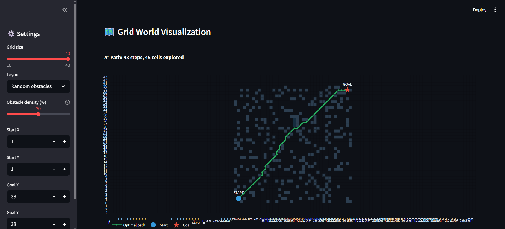

# Autonomous Robot Path Planning Simulator
**Path finder**

 
## Overview
A* pathfinding algorithm for autonomous robot navigation
on a 2D grid world. Interactive: set obstacles, start/goal,
grid size. Visualizes optimal path and explored cells.
 
## Live Demo
**[Open Simulator](https://oscar0806-robot-path-planner-app-cnh3hm.streamlit.app/)**
 
## Features
- A* algorithm with 8-directional movement
- 3 layouts: warehouse shelves, random, empty
- Adjustable grid size (10-40)
- Path cost + efficiency metrics
- Explored cells visualization (search space)
  
## Author
**Oscar Vincent Dbritto**
